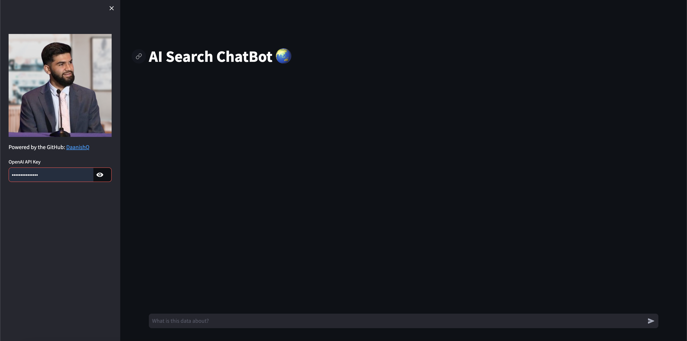

# AI Search ChatBot 🌏

## Overview

This repository hosts code for an AI-powered chatbot designed for search purposes. The chatbot utilizes OpenAI's GPT-3.5 Turbo model for natural language understanding and response generation. It enables users to interact with the system by asking questions or providing prompts related to the desired search query.

## Features

- **Natural Language Search:** Users can input queries in natural language to perform searches.
- **Real-time Responses:** The chatbot provides responses in real-time based on the input query.
- **Streamlit Interface:** The user interface is built using Streamlit, making it easy to use and deploy.

## Installation

1. Clone this repository:

```bash
git clone https://github.com/DaanishQ/AI-Search-ChatBot.git
```

2. Install dependencies:

```bash
pip install -r requirements.txt
```

## Usage

1. Run the Streamlit app:

```bash
streamlit run "AI Search ChatBot.py"
```

2. Enter your OpenAI API key in the sidebar input field.
3. Interact with the chatbot by typing queries or questions related to the desired search topic.
4. View the responses provided by the chatbot in real-time.

## Screenshots



## Contributors

- [DaanishQ](https://github.com/DaanishQ) - Creator and Maintainer

## License

This project is licensed under the MIT License - see the [LICENSE](LICENSE) file for details.
